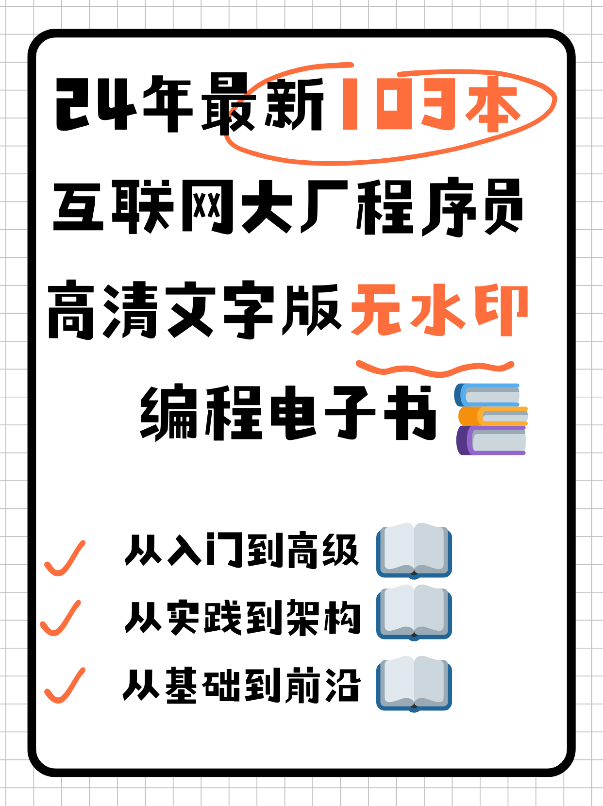
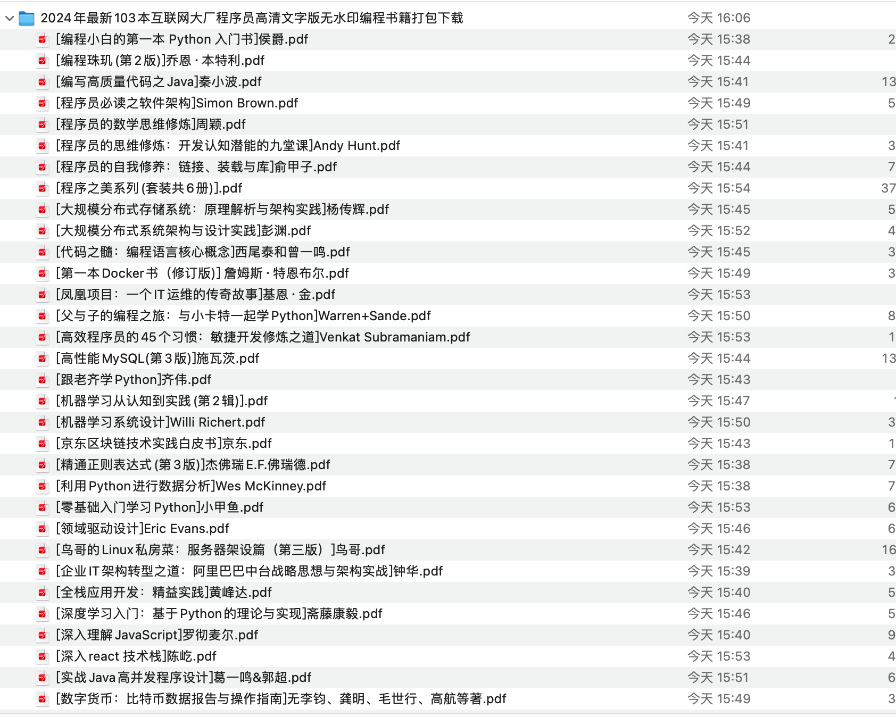
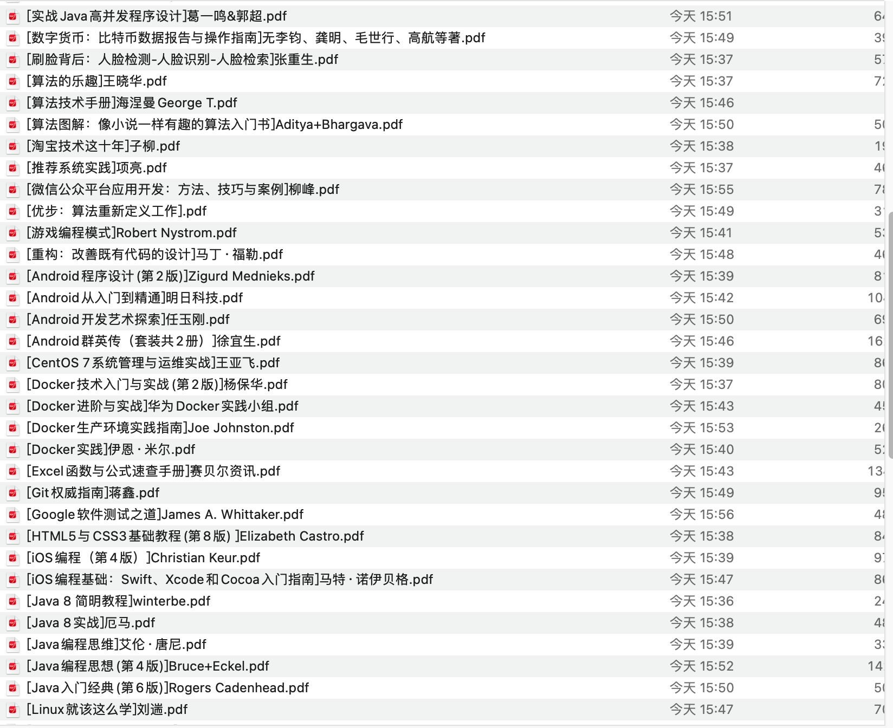
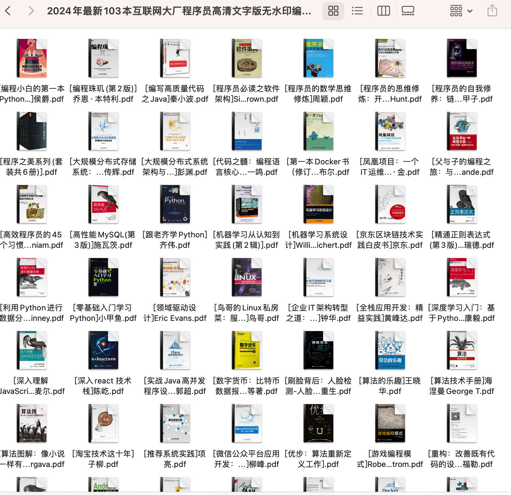

[夸克网盘: 「2024年最新103本互联网大厂程序员高清文字版无水印编程书籍打包下载.zip」](https://pan.quark.cn/s/bda471d09215)

[123盘： 2024年最新103本互联网大厂程序员高清文字版无水印编程书籍打包下载.zip](https://www.123865.com/s/sn80Td-J5ot)

[Rapidgator网盘: 2024年最新103本互联网大厂程序员高清文字版无水印编程书籍打包下载.zip](https://rg.to/file/b34d0edc97c5d845c88886d6cf746eb9/2024年最新103本互联网大厂程序员高清文字版无水印编程书籍打包下载.zip.html)

google网盘:2024年最新103本互联网大厂程序员高清文字版无水印编程书籍打包下载.zip](https://drive.google.com/file/d/13E_iEA3B8TcZgmsCRpCNCoSnXBNEEiel/view?usp=drive_link)

更多免费无水印编程电子书下载，可以去[资料吧](https://ziliaoba.github.io)(部分地区得翻wall🪜)右上角搜索关键字"编程"，无需注册即可下载。

# 完整目录
- [编程小白的第一本 Python 入门书]侯爵.pdf
- [编程珠玑(第2版)]乔恩·本特利.pdf
- [编写高质量代码之Java]秦小波.pdf
- [程序员必读之软件架构]Simon Brown.pdf
- [程序员的数学思维修炼]周颖.pdf
- [程序员的思维修炼：开发认知潜能的九堂课]Andy Hunt.pdf
- [程序员的自我修养：链接、装载与库]俞甲子.pdf
- [程序之美系列(套装共6册)].pdf
- [大规模分布式存储系统：原理解析与架构实践]杨传辉.pdf
- [大规模分布式系统架构与设计实践]彭渊.pdf
- [代码之髓：编程语言核心概念]西尾泰和曾一鸣.pdf
- [第一本Docker书（修订版)] 詹姆斯·特恩布尔.pdf
- [凤凰项目：一个IT运维的传奇故事]基恩·金.pdf
- [父与子的编程之旅：与小卡特一起学Python]Warren+Sande.pdf
- [高效程序员的45个习惯：敏捷开发修炼之道]Venkat Subramaniam.pdf
- [高性能MySQL(第3版)]施瓦茨.pdf
- [跟老齐学Python]齐伟.pdf
- [机器学习从认知到实践(第2辑)].pdf
- [机器学习系统设计]Willi Richert.pdf
- [京东区块链技术实践白皮书]京东.pdf
- [精通正则表达式(第3版)]杰佛瑞E.F.佛瑞德.pdf
- [利用Python进行数据分析]Wes McKinney.pdf
- [零基础入门学习Python]小甲鱼.pdf
- [领域驱动设计]Eric Evans.pdf
- [鸟哥的Linux私房菜：服务器架设篇（第三版）]鸟哥.pdf
- [企业IT架构转型之道：阿里巴巴中台战略思想与架构实战]钟华.pdf
- [全栈应用开发：精益实践]黄峰达.pdf
- [深度学习入门：基于Python的理论与实现]斋藤康毅.pdf
- [深入理解JavaScript]罗彻麦尔.pdf
- [深入react 技术栈]陈屹.pdf
- [实战Java高并发程序设计]葛一鸣&郭超.pdf
- [数字货币：比特币数据报告与操作指南]无李钧、龚明、毛世行、高航等著.pdf
- [刷脸背后：人脸检测-人脸识别-人脸检索]张重生.pdf
- [算法的乐趣]王晓华.pdf
- [算法技术手册]海涅曼George T.pdf
- [算法图解：像小说一样有趣的算法入门书]Aditya+Bhargava.pdf
- [淘宝技术这十年]子柳.pdf
- [推荐系统实践]项亮.pdf
- [微信公众平台应用开发：方法、技巧与案例]柳峰.pdf
- [优步：算法重新定义工作].pdf
- [游戏编程模式]Robert Nystrom.pdf
- [重构：改善既有代码的设计]马丁·福勒.pdf
- [Android程序设计(第2版)]Zigurd Mednieks.pdf
- [Android从入门到精通]明日科技.pdf
- [Android开发艺术探索]任玉刚.pdf
- [Android群英传（套装共2册）]徐宜生.pdf
- [CentOS 7系统管理与运维实战]王亚飞.pdf
- [Docker技术入门与实战(第2版)]杨保华.pdf
- [Docker进阶与实战]华为Docker实践小组.pdf
- [Docker生产环境实践指南]Joe Johnston.pdf
- [Docker实践]伊恩·米尔.pdf
- [Excel函数与公式速查手册]赛贝尔资讯.pdf
- [Git权威指南]蒋鑫.pdf
- [Google软件测试之道]James A. Whittaker.pdf
- [HTML5与CSS3基础教程(第8版) ]Elizabeth Castro.pdf
- [iOS编程（第4版）]Christian Keur.pdf
- [iOS编程基础：Swift、Xcode和Cocoa入门指南]马特·诺伊贝格.pdf
- [Java 8 简明教程]winterbe.pdf
- [Java 8实战]厄马.pdf
- [Java编程思维]艾伦·唐尼.pdf
- [Java编程思想(第4版)]Bruce+Eckel.pdf
- [Java入门经典(第6版)]Rogers Cadenhead.pdf
- [Linux就该这么学]刘遄.pdf
- [Node.js权威指南 (实战)]陆凌牛.pdf
- [Python Cookbook（第3版）中文版]David Beazley.pdf
- [Python3.5从零开始学]刘宇宙.pdf
- [Python编程：从入门到实践]Eric Matthes.pdf
- [Python编程快速上手：让繁琐工作自动化]斯维加特.pdf
- [Python核心编程(第3版)] Wesley Chun.pdf
- [Python面向对象编程指南]Steven F. Lott 洛特.pdf
- [Python学习手册（原书第4版）]Mark Lutz.pdf
- [SQL必知必会]Ben+Forta.pdf
- [SQL入门经典(第5版)]Ryan Stephens.pdf
- [Swift开发指南(修订版)]关东升.pdf
- [The Swift Programming Language中文版-v1.8].pdf
- [Unity开发实战(第1辑)(套装共3册)]冯乐乐.pdf
- [Vue2实践揭秘]梁睿坤.pdf- 
